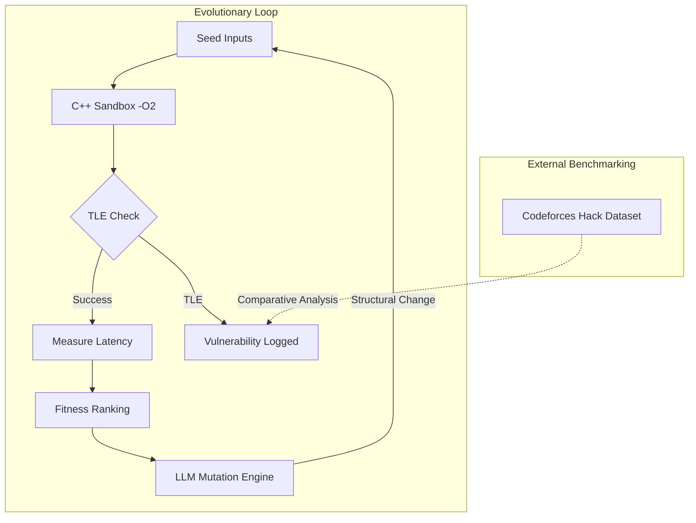

# Auto-Hack-Evolutionary-LLM-Fuzzing-for-AlgoDoS

An automated research framework for identifying algorithmic denial-of-service (AlgoDoS) vectors in C++ implementations by evolving adversarial inputs that trigger worst-case time complexity.

## 1. Technical Architecture

The system operates as a closed-loop evolutionary pipeline, shifting the focus from traditional memory-safety fuzzing to **asymptotic performance degradation**.

### 1.1 The High-Fidelity Sandbox
To ensure measurements reflect algorithmic efficiency rather than environmental noise, the sandbox implements the following:
*   **Compilation:** Targets are compiled using `g++ -O2` to mirror production and competitive programming environments.
*   **Execution Isolation:** Inputs are passed via `subprocess.run` with a strict `SIGALRM` or `TimeoutExpired` threshold (default: 3.0s).
*   **Precision Measurement:** Latency is recorded using `time.perf_counter()` to achieve sub-millisecond resolution across multiple trials.

### 1.2 Fitness Function
The fitness of a test case is defined by its execution latency. The system promotes "Elite" inputs—those that maximize CPU cycles for a fixed input size $N$—to the next generation.

### 1.3 LLM-Guided Mutation
Unlike random fuzzers, the mutation engine utilizes Large Language Models (LLMs) constrained by specific system prompts. The mutation is **Constraint-Locked**: the LLM is forbidden from increasing the input size $N$. It must instead reconfigure the structural arrangement of the data (e.g., pivot-killing sequences for QuickSort or hash-collision clusters for Hash Maps) to maximize latency.

---

## 2. Architecture Flow



---

## 3. Validation Strategy

This research employs a **ground-truth benchmarking** methodology. Rather than testing against synthetic "toy" problems, we utilize a dataset of 15+ real-world C++ submissions from Codeforces that were historically "hacked" during live contests.

*   **Objective:** To determine if the autonomous fuzzer can rediscover or exceed the performance of human-generated adversarial inputs.
*   **Baseline:** The fuzzer's performance is measured against both random fuzzing (control group) and the original human hacker's test case (performance ceiling).

---

## 4. Repository Structure

```text
├── src/
│   ├── fuzzer.py           # Core evolutionary logic
│   ├── sandbox.py          # C++ execution and profiling module
│   ├── mutator.py          # LLM API integration and prompt engineering
│   └── utils/              # Data parsing and telemetry
├── victims/
│   ├── hashmap_weak.cpp    # Target C++ implementations
│   ├── quicksort_naive.cpp
│   └── graph_bfs.cpp
├── data/
│   ├── benchmarks/         # Codeforces ground-truth inputs
│   └── results/            # CSV logs and execution traces
├── scripts/
│   └── visualize.py        # Generation of Matplotlib research graphs
└── README.md
```

---

## 5. Thesis Statement
This tool is designed specifically for identifying structural vulnerabilities in algorithms that fail under adversarial input patterns. The research demonstrates that by combining evolutionary strategies with the reasoning capabilities of LLMs, it is possible to automate the discovery of "logic bombs" in implementations that are otherwise memory-safe and functionally correct under average-case testing.

---
**Lead Researchers:** Nimit Arayn & Sejal Patil 
**Academic Year:** 2026
