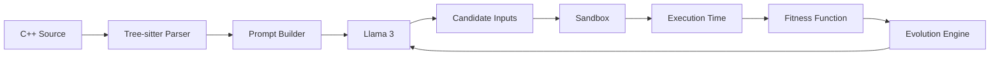
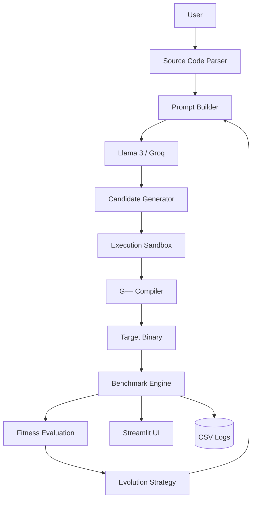
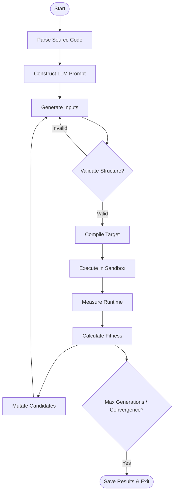

# Auto-Hack: Evolutionary LLM Fuzzing for AlgoDoS

<div align="center">

[](https://www.python.org/)
[](https://isocpp.org/)
[](https://groq.com/)
[](https://meta.ai/)
[](LICENSE)

**An automated research framework for discovering Algorithmic Denial-of-Service (AlgoDoS) vulnerabilities using Evolutionary Fuzzing and Large Language Models.**

</div>

---

## 📖 Table of Contents

- [Overview](#-overview)
- [Motivation](#-motivation)
- [Key Features](#-key-features)
- [System Architecture & Workflows](#-system-architecture--workflows)
  - [System Workflow](#system-workflow)
  - [System Architecture](#system-architecture)
  - [Fuzzing Pipeline](#fuzzing-pipeline)
- [Technology Stack](#technology-stack)
- [Project Structure](#-project-structure)
- [Installation & Setup](#-installation--setup)
  - [Installation](#installation)
  - [Configuration](#configuration)
  - [Running the Framework](#running-the-framework)
- [Core Components](#-core-components)
  - [Sandbox Execution](#sandbox-execution)
  - [Fitness Function](#fitness-function)
  - [Evolution Strategy](#evolution-strategy)
  - [Prompt Generation](#prompt-generation)
  - [Input Validation](#input-validation)
- [Telemetry & Logging](#-telemetry--logging)
- [Research & Future Directions](#-research--future-directions)
- [Contributing & License](#-contributing--license)

---

## Overview

**Auto-Hack** is a research-oriented framework designed to automatically discover worst-case execution inputs for C++ programs. 

Unlike traditional fuzzers that prioritize crashes or memory corruption, this framework searches for **inputs that maximize execution time**, exposing algorithmic complexity vulnerabilities (such as Algorithmic Denial of Service).

The framework integrates:
*  **Static Source-Code Analysis** via Tree-sitter.
*  **LLM-Assisted Input Generation** via Groq & Llama 3.
*  **Evolutionary Optimization** (Genetic Algorithms) to evolve input structures.
*  **Runtime Benchmarking** within an isolated execution sandbox.
*  **Automated Repair Loops** to fix malformed inputs dynamically.

---

## Motivation

Many production systems and competitive programming solutions contain hidden worst-case execution complexities that are rarely triggered during typical testing. 

These include:
* **Worst-case complexities** such as $O(N^2)$ or $O(N^3)$ regressions in sorting or searching.
* **Exponential recursion** depths and unoptimized call stacks.
* **Degenerate data structures** (e.g., unbalanced trees, hash collisions).
* **Pathological graph inputs** designed to maximize traversal times.

Auto-Hack automates the search for these pathological edge cases through combined LLM intelligence and evolutionary feedback loops.

---

## Key Features

* **LLM-Guided Fuzzing**: Generates highly structured, context-aware inputs instead of raw random mutation.
* **Evolutionary Engine**: Optimizes input structures over multiple generations to find execution bottlenecks.
* **Self-Repair Loop**: Automatically corrects syntax or formatting errors in generated inputs.
* **Isolated Sandbox Execution**: Compiles and executes targets safely with strict resource and timeout enforcement.
* **Structural Parsing**: Utilizes Tree-sitter to analyze target source code for variables, loops, constraints, and data types.
* **Interactive Dashboard**: Streamlit interface to visualize runtime trends, population fitness, and evolution history in real-time.

---

## System Architecture & Workflows

### System Workflow

```mermaid
flowchart LR
    A[C++ Source] --> B[Tree-sitter Parser]
    B --> C[Prompt Builder]
    C --> D[Llama 3]
    D --> E[Candidate Inputs]
    E --> F[Sandbox]
    F --> G[Execution Time]
    G --> H[Fitness Function]
    H --> I[Evolution Engine]
    I --> D
```

### System Architecture

```mermaid
graph TD
    User --> Parser[Source Code Parser]
    Parser --> Prompt[Prompt Builder]
    Prompt --> LLM[Llama 3 / Groq]
    LLM --> Generator[Candidate Generator]
    Generator --> Sandbox[Execution Sandbox]
    Sandbox --> Compiler[G++ Compiler]
    Compiler --> Executable[Target Binary]
    Executable --> Benchmark[Benchmark Engine]
    Benchmark --> Fitness[Fitness Evaluation]
    Fitness --> Evolution[Evolution Strategy]
    Evolution --> Prompt
    Benchmark --> Dashboard[Streamlit UI]
    Benchmark --> CSV[(CSV Logs)]
```

### Fuzzing Pipeline

```mermaid
flowchart TD
    Start([Start]) --> Parse[Parse Source Code]
    Parse --> Prompt[Construct LLM Prompt]
    Prompt --> Generate[Generate Inputs]
    Generate --> Validate{Validate Structure?}
    
    Validate -- Invalid --> Generate
    Validate -- Valid --> Compile[Compile Target]
    
    Compile --> Execute[Execute in Sandbox]
    Execute --> Measure[Measure Runtime]
    Measure --> Fitness[Calculate Fitness]
    
    Fitness --> Mutate[Mutate Candidates]
    Mutate --> Generate
    
    Fitness --> Stop{Max Generations / Convergence?}
    Stop -- Yes --> Results([Save Results & Exit])
```

---

## Technology Stack

### Core Technologies

| Category | Technology | Description / Use Case |
| :--- | :--- | :--- |
| **Language** | Python 3.10+ | Core orchestration and evolutionary logic |
| **Target Language** | C++20 | Standard benchmarked language environment |
| **Inference Provider** | Groq API | High-throughput, low-latency LLM inference |
| **Model** | Llama 3 | Input structural synthesis and understanding |
| **Parser** | Tree-sitter | High-fidelity AST parsing of C++ sources |
| **Runtime Control** | `subprocess` | Sandboxed execution, compilation, and process limits |
| **Visualization** | Streamlit / Matplotlib | Interactive UI and performance analytics graphing |

---

## Project Structure

```text
Auto-Hack/
├── benchmarks/             # Saved performance runs
├── dashboard/              # Streamlit interface components
├── dataset/                # Test target C++ source files
├── generated_inputs/       # Inputs generated during execution
├── logs/                   # System runtime logs
├── prompts/                # Prompt templates for LLM code understanding
│
├── config.py               # Central configuration settings
├── dashboard.py            # Streamlit dashboard application
├── evaluator.py            # Fitness assessment and benchmarking
├── evolution.py            # Genetic algorithm operators
├── generator.py            # LLM interface and input repair
├── main.py                 # Framework entrypoint
├── parser.py               # Tree-sitter source analysis
├── sandbox.py              # Compilation and resource control
│
├── LICENSE                 # License information
├── README.md               # Project documentation
└── requirements.txt        # Python package dependencies
```

---

## Installation & Setup

### Installation

1. **Clone the repository:**
   ```bash
   git clone https://github.com/USERNAME/Auto-Hack.git
   cd Auto-Hack
   ```

2. **Create and activate a virtual environment:**
   * **Linux/macOS:**
     ```bash
     python -m venv venv
     source venv/bin/activate
     ```
   * **Windows:**
     ```bash
     python -m venv venv
     venv\Scripts\activate
     ```

3. **Install dependencies:**
   ```bash
   pip install -r requirements.txt
   ```

### Configuration

Create a `.env` file in the root directory:

```env
GROQ_API_KEY=your_groq_api_key_here
MODEL=llama3-8b-8192
TIMEOUT=3
MAX_GENERATIONS=50
POPULATION_SIZE=20
```

### Running the Framework

1. **Start the fuzzing run:**
   ```bash
   python main.py
   ```

2. **Launch the visualization dashboard:**
   ```bash
   streamlit run dashboard.py
   ```

---

## Core Components

### Sandbox Execution
The execution sandbox limits exposure and maintains testing safety. It is responsible for:
* Building C++ binaries securely using configured compiler flags (`g++ -O2 -std=c++20`).
* Managing precise process-level execution using isolated standard input streams.
* Enforcing strict resource constraints, process limits, and execution timeouts.
* Cleaning up artifacts post-execution.

### Fitness Function
Quality of mutated inputs is evaluated through resource consumption metrics. The primary objective is:
$$\text{Fitness}(C) = \text{Execution Time of } C$$
Inputs that cause processing latency without crashing the program receive higher priority inside the evolution queue.

### Evolution Strategy
Each generation undergoes classical selection and mutation steps:
1. **Selection:** Selection of the highest-latency candidates (Elitism).
2. **Mutation:** Language-model-driven structure modifications to generate variations.
3. **Evaluation:** Sandbox execution to acquire execution times.
4. **Survivor Selection:** Replacing lower-tier candidates while preserving high-performing elites.

### Prompt Generation
The Tree-sitter integration parses target functions to identify structural indicators:
* Recursion patterns and execution loops.
* Array dimension declarations.
* Operational constraints (e.g., maximum limits, data boundaries).
Using these metadata properties, the framework auto-generates precise instructions directing the LLM to write inputs that trigger worst-case paths.

### Input Validation
Before execution inside the target binary, candidate inputs undergo structural validation:
* Checking formatting rules and array limits.
* Validating input types against target expected structures.
* Discarding empty, corrupt, or syntactically invalid payloads to avoid execution waste.

---

## Telemetry & Logging

The system saves and processes continuous performance indicators across multiple export files:

| Log File | Contents |
| :--- | :--- |
| `benchmarks.csv` | Compilation status, execution records, and global runtime metrics. |
| `generation_history.csv` | Evolution metrics per generation (average/max runtime, mutations). |
| `best_inputs.csv` | Payloads that produced the highest execution latency. |
| `runtime_logs.csv` | Standard error logs, debugging trace information, and system warnings. |

---

## Research & Future Directions

* **Multi-Language Support:** Extending targets to Rust, Go, and Java.
* **Distributed Benchmarking:** Distributing candidate execution across multiple nodes.
* **Reinforcement Learning:** Utilizing reward feedback loops to optimize mutating steps.
* **Hybrid Testing:** Integrating symbolic execution tools to solve path constraints.
* **Containerized Sandboxing:** Isolating running binaries natively within transient Docker runtimes.

---

## Contributing

We welcome structural improvements, research papers, and code contributions.
1. Fork this repository.
2. Create a new branch (`git checkout -b feature-improvement`).
3. Commit changes (`git commit -m 'Added target feature'`).
4. Push branch details (`git push origin feature-improvement`).
5. Create a new Pull Request.

---

## 📄 License

This framework is released under the **MIT License**. For details, review the [LICENSE](LICENSE) file.
